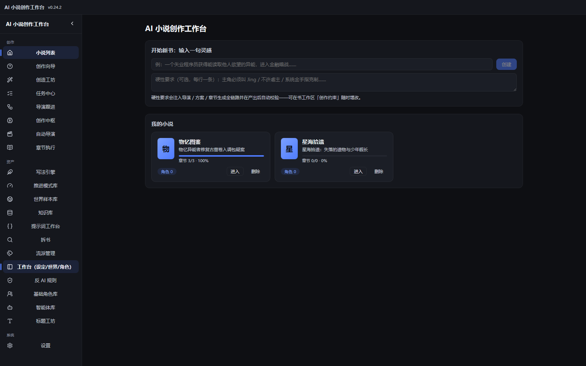
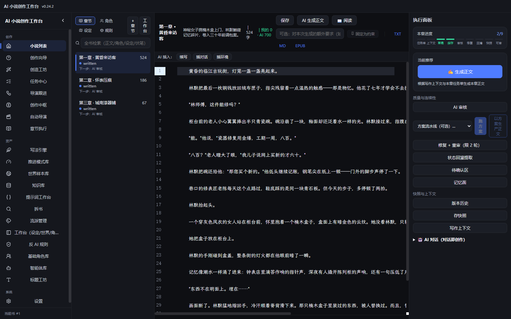

# AI-Novel-Studio · AI 小说创作工作台

**中文** | [English](README.en.md)

<!-- 仓库整理（2026-08-12）：shields badge——版本/CI/License/平台 -->


面向长篇小说创作的 **AI 导演式生产系统**（Electron 桌面应用）：从一句灵感推进到完整小说——规划、生成、审核、修复、状态回灌全链路。

<p align="center">
  
  <br />
  <em>书目列表 · 侧栏导航 · 主题化暗色 UI</em>
  <br /><br />
  
  <br />
  <em>章节执行 · 书内全文检索 · 阅读模式 · 方案流水线 · 质量/回灌闭环</em>
</p>

## 为什么用它？

写长篇最大的敌人是**连续性**：几十万字里人设不崩、伏笔不丢、风格统一。AI-Novel-Studio 把"写书"拆成可管理的生产链——AI 导演规划整本，章节级生成/审核/修复闭环，状态回灌保证全书一致；你也可以导入 Feelfish 的智能体方案，把它变成自己的创作流水线。

## 核心能力

- **自动导演**：11 阶段整本生产链（灵感 → 方向 → 设定 → 宏观 → 世界观 → 角色 → 卷 → 节奏 → 拆章 → 细化 → 可写），全自动/半自动双模式，检查点恢复；任务看门狗与取消感知
- **创造工坊**：一句话 → AI 生成创作方案（智能体流水线）；可视化编辑/试运行/保存；支持导入 Feelfish 智能体定义与方案；技能体系 + 智能体资产化
- **章节执行链**：生成（SSE 流式 + 引导输入框）→ AI 审核 → 修复（局部补丁优先）→ 状态回灌；版本历史可查看/恢复/对比 diff、30 秒自动保存、反 AI 词自动重写
- **阅读与检索（v0.24.2）**：章节阅读/复盘模式（.prose 排印 + 字号可调 + 上下章导航）；书内全文检索（正文/角色/设定/伏笔/事实/知识库分组）；方案一键整本生产（绑定方案 → job 队列逐章流水线）
- **方案生产流水线**：书级绑定生产方案后，整本批量生产逐章走智能体接力（大纲→片段→审校→最终合并），已真机验证 Feelfish mc-good2.0 10 步方案跑通
- **资产库统一建设**：知识库 / 世界样本库 / 推进模式库 / 写法引擎 / 流派管理 / 反 AI 规则 / 标题工坊 / 基础角色库 / 拆书——上传文件（TXT/MD/EPUB 自动分章）+ 粘贴文本 + AI 提取草稿 → 人工修改 → 保存
- **任务中心**：后台任务统一管理，失败可换模型重试/从断点继续
- **模型路由**：任务级模型分配 + 供应商 fallback + 成本仪表盘（缓存命中率 + 质量债追踪）
- **OpenCode Go 网关**：一键导入订阅凭证，聚合 DeepSeek/GLM/GPT/Grok/Kimi 等模型
- **多主题 / 字体排版**：7 套界面主题（含 sepia 暖色文学风）；3 款打包开源字体 + 5 款系统字体，首行缩进/行距/字号/阅读宽度可调

## 快速上手

[📖 入门教程（4 步上手）](docs/getting-started.md) · [📦 下载最新版](https://github.com/507513730/ai-novel-studio/releases/latest)

1. 安装应用（Windows 安装版或便携版）
2. 设置页 → 导入模型凭证（OpenCode Go 或 DeepSeek 等）
3. 新建小说，输入一句灵感 → AI 自动导演规划整本
4. 章节页生成正文，AI 审核修复，导 TXT/MD/EPUB

## 技术栈

Electron 43 + React 19 + TypeScript + Vite 7 + Express 5 + node:sqlite（零原生依赖）+ CodeMirror 6

## 开发

```powershell
pnpm install
pnpm dev            # 开发（electron-vite 三端）
pnpm typecheck      # 类型检查
pnpm lint           # ESLint
pnpm test           # vitest 单测（数量以 pnpm test 为准）
pnpm db:smoke       # 数据库冒烟（7 项）
pnpm release        # 发布流程（文档检查/验证/本地构建/推送，--push 半自动）
pnpm dist           # 打包 NSIS 安装版 + portable
```

## 数据与卸载

- 数据存于 `%APPDATA%\ai-novel-studio`（与安装目录分离；便携版跟随可执行文件 data/）
- 设置页「外观 > 数据与卸载」：打开数据目录 / 导出备份 / 从备份恢复 / 清除全部数据

## 发布

推送版本 tag（如 `v0.9.1`）自动构建并发布 Releases。版本规范见 [docs/versioning.md](docs/versioning.md)（SemVer + CI 强制 tag==version 校验）。

## 文档

- [📖 入门教程](docs/getting-started.md)：第一次使用的完整路径
- [docs/README.md](docs/README.md)：全部文档索引（架构 / 变更日志 / 决策日志 / 版本规范 / 审查追踪 / 测试报告）
- [docs/CHANGELOG.md](docs/CHANGELOG.md)：版本变更记录（Keep a Changelog 格式）
- [PLAN.md](PLAN.md)：当前计划（定位/进度/遗留）；历史编年史见 [docs/archive/PLAN-history.md](docs/archive/PLAN-history.md)

## 目录结构

```
client/src/    React 渲染层（pages/ workspace/ components/ editor/ utils/）
server/src/    服务层（routes/ services/ db/ prompts/）
electron/      主进程（窗口/菜单/utilityProcess/安全）
shared/        前后端共享类型
scripts/       发布流程 / 校准 / e2e 测试脚本
docs/          架构 / 变更日志 / 决策日志 / 版本规范 / 审查追踪
```

## 测试

- `pnpm test`：vitest 单测（补丁修复/导演/SSE 取消/成本估算/模型覆盖/世界渲染/方案资产/引导系统/创作约束/记忆面/审查回归/字数覆盖语义/UI 主题/版本 diff/全文检索，178+ 项）
- `node scripts/e2e/round.mjs <n>`：全功能 e2e（T1 配置/T2 创作链/T3 资产/T4 导演/T5 功能回归）

## 贡献

见 [CONTRIBUTING.md](CONTRIBUTING.md)：Bug/功能建议开 Issue（有模板），代码贡献遵循 Conventional Commits + PR 流程，本地验证命令齐全。

## 帮助

- **问题/Bug/建议**：[新建 Issue](https://github.com/507513730/ai-novel-studio/issues/new/choose)
- **安全漏洞**：见 [SECURITY.md](SECURITY.md)（私密报告，勿发公开 Issue）
- **社区行为**：见 [CODE_OF_CONDUCT.md](CODE_OF_CONDUCT.md)

## FAQ

**需要付费吗？** 应用本身免费开源（MIT）。AI 生成消耗你自有模型供应商的额度（OpenCode Go 订阅 / DeepSeek 等 API 按量付费）。

**支持哪些模型？** 任意 OpenAI 兼容 API：DeepSeek、GLM、GPT、Grok、Kimi 等（多供应商 + 任务级路由 + fallback）。

**数据存在哪里？** 全部本地 SQLite，不上传云端；API Key 经系统密钥环加密存储。

**能导入 Feelfish 的方案吗？** 可以——创造工坊支持导入 Feelfish 智能体（.md）与方案（solution.json），导入后可直接绑定章节生产。

## License

[MIT](LICENSE) © 2026 ai-novel-studio
